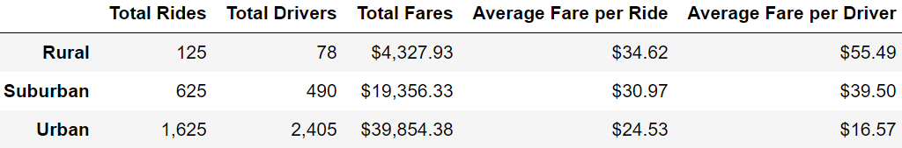
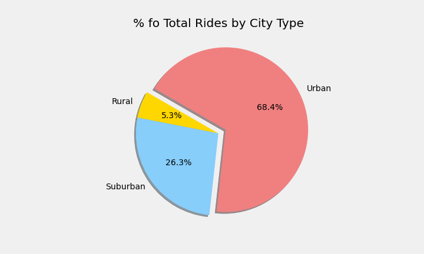
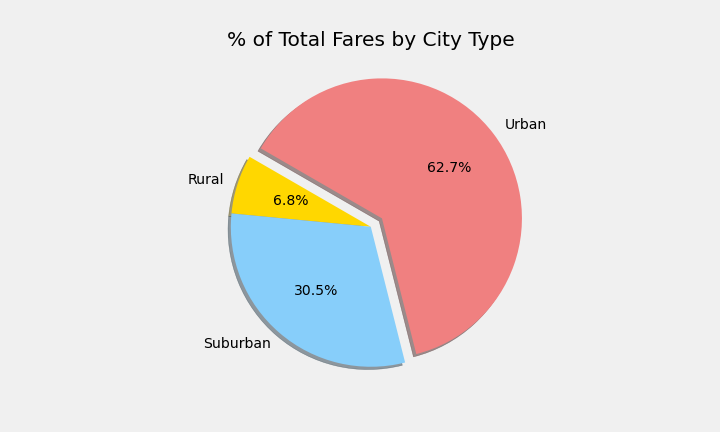
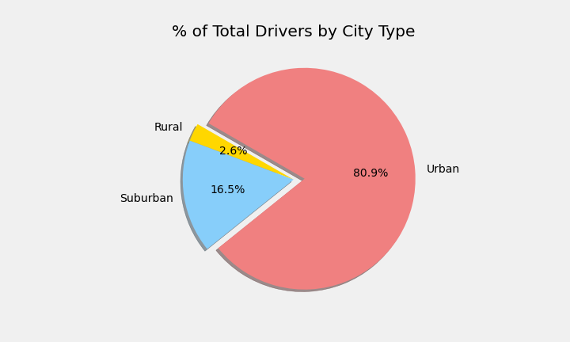

# PyBer_Analysis

## Overview of Project
- Create a summary of the 2019 PyBer ride sharing data by the city type (Urban, Suburban, and Rural) to uncover meaningful insights. 
- Using Pandas and Matplotlib, create a multiple-line graph that shows the total weekly fares for each city type. 
- Summarizes how the data differs by city type and how those differences can be used by decision-makers at PyBer.

## Analysis Results
 

### Total Rides
From our analysis set we find that there were 2,375 total rides completed. 
- 1,625 were in urban areas 
- 625 were in suburban areas
- 125 were in rural areas 

The Chart below shows the percent of the total number of rides that each city type represents.
 
 

### Total/Average Fares
The fare total generated from all rides was $63,538.68
- $39,854.38 were in urban areas for an average of $24.53 per ride
- $19,356.33 were in suburban areas for an average of $30.97 per ride
- $4,327.97 were in rural areas for an average of $34.62 per ride. 

The Chart below shows the percent of the total number of rides that each city type represents.
 
 

### Driver Totals and Fares
After summarizing the data we find that there were 2,973 total drivers accross all city types. 
- 2,405 were in urban areas and generated fares of $16.57 on average.
- 490 were in suburban areas and generated fares of $39.50 on average.
- 78 were in rural areas and generated fares of $55.48 on average.  

The Chart below shows the percent of the total number of drivers for each city type.
 
 

### Fare Trend (January - April)
The graph below shows the weekly fares totals by city type during the first 4 months of 2019. 
 
 

## Summary and Recommendations
After reviewing the analysis results we have found several trends. 
- Although only 5.3% of rides are in rural areas these rides account for nearly 7% of total fares generated. The average rural fare is over $10 higher than in urban ares, simply put riders in rural areas are having to travel further and pay more to get to their destinations.. The high fare does not correlate to high driver counts as only 2.6% of drivers are in rural areas. 
- While 86% of rides and 63% of fares come from urban areas nearly 81% of drivers can be found in urban areas. Because of the high supply of drivers given the demand the average fare per driver is only 42% of those in suburban areas and  less than 30% of those in rural areas. To find a better equilibrium we should do one of, or a combination of the following. 
 
Based on these trends we suggest the following. (2 and 3 can work independently or in tandem) 
1. Increase in rural driver pay to incentivize more drivers, this will help us capitalize on high fares. 
2. Decrease the fare for the rider to increase the demand and meet the driver supply.
3. Slightly decrease the portion of the fare that goes to the driver. This will decrease the driver supply but will not impact the demand for rides, the company's per ride margins will increase. 
